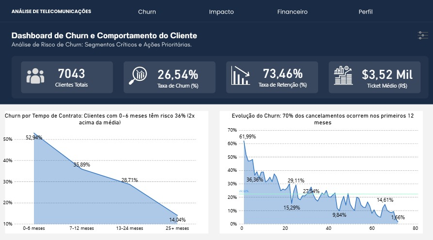
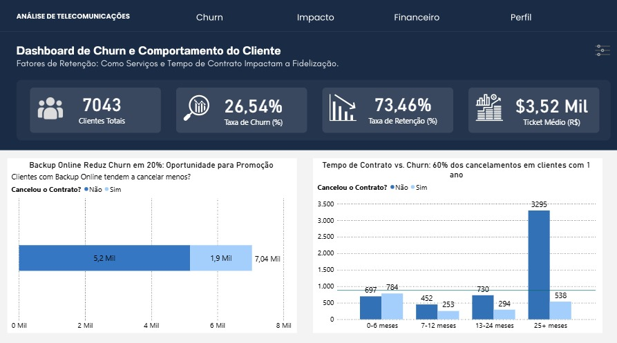
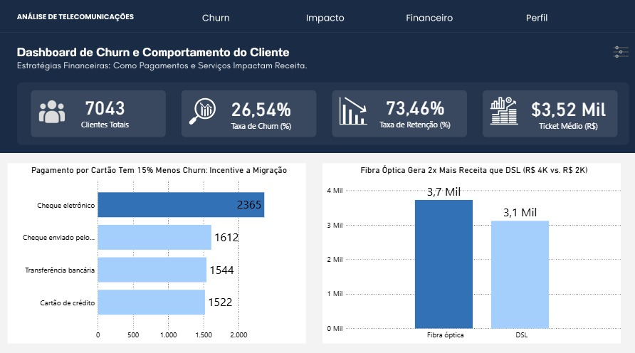
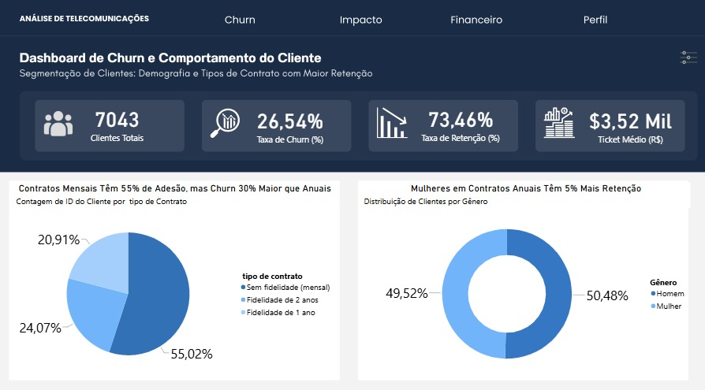

# Dashboard de Churn e Comportamento do Cliente

Análise de risco de cancelamento (churn) de clientes de uma empresa de telecomunicações, desenvolvida em Power BI a partir do dataset público **Telco Customer Churn** (IBM / Kaggle).

**Dashboard publicado (Power BI):** [Acessar dashboard](https://app.powerbi.com/view?r=eyJrIjoiNDI1NWEwNTUtYjUxZC00MDVjLWJmMTktMDkwNWQ5MGI1YmYzIiwidCI6IjdlMjU2YWE5LTRhMjAtNGY1MS05YTQxLWRjNTM4ZTlmMzQ3OCJ9&pageName=ReportSection&autoAuth=true&ctid=7e256aa9-4a20-4f51-9a41-dc538e9f3478&filterPaneEnabled=false&navContentPaneEnabled=false)

---

## Descrição

Este projeto apresenta um dashboard interativo em Power BI voltado à análise de **churn (cancelamento de clientes)** em uma empresa de telecomunicações. O painel foi construído em quatro páginas (**Churn**, **Impacto**, **Financeiro** e **Perfil**), que exploram, respectivamente, os padrões temporais do cancelamento, os fatores associados à retenção, os impactos financeiros do churn e a segmentação demográfica/contratual da base de clientes.

## Objetivo

Consolidar em um único painel visual as principais métricas de cancelamento de clientes, permitindo identificar:

- Em que momento do ciclo de vida do cliente o risco de churn é maior;
- Quais serviços e formas de pagamento estão associados a menor cancelamento;
- Qual o impacto financeiro do churn na receita;
- Qual o perfil demográfico e contratual mais suscetível a cancelar.

## Contexto de Negócio

Empresas de telecomunicações atuam em um mercado altamente competitivo, no qual a retenção de clientes é, em geral, mais econômica do que a aquisição de novos clientes. O churn (taxa de cancelamento) é um dos indicadores mais críticos de saúde do negócio, pois impacta diretamente a receita recorrente, o custo de aquisição de clientes (CAC) e o valor do ciclo de vida do cliente (LTV).

## Problema que o Dashboard Resolve

O dashboard responde a perguntas de negócio como:

- Qual a taxa de churn atual da base de clientes?
- Em quais faixas de tempo de contrato (tenure) o cancelamento é mais concentrado?
- Quais serviços contratados (ex.: backup online) estão associados a menor churn?
- Quais formas de pagamento e tipos de internet têm maior relação com receita e cancelamento?
- Qual tipo de contrato (mensal, anual, bianual) concentra mais clientes e mais cancelamentos?
- Existe diferença de retenção entre gêneros?

## Dataset Utilizado

- **Nome:** Telco Customer Churn
- **Fonte oficial (Kaggle):** https://www.kaggle.com/datasets/blastchar/telco-customer-churn
- **Origem:** IBM Sample Data Sets
- **Registros:** 7.043 clientes
- **Colunas:** 21 atributos, incluindo a variável alvo `Churn`

## Tecnologias Utilizadas

- **Power BI**: construção do dashboard, modelagem e medidas
- **Power Query (M)**: importação e transformação dos dados (inferido a partir da estrutura do modelo; etapas específicas não são visíveis externamente)
- **DAX**: cálculo de indicadores e medidas (inferido a partir dos KPIs exibidos)
- **Markdown**: documentação técnica do projeto
- **GitHub**: versionamento 

## Ferramentas Utilizadas

- Power BI Desktop (desenvolvimento)
- Power BI Service (publicação do relatório via link público)
- Kaggle (fonte do dataset)

## Processo de Preparação dos Dados

> **Observação:** o processo de ETL não é totalmente visível apenas a partir do dashboard publicado e das imagens das páginas. As informações abaixo combinam o que é **observável no dashboard** com **hipóteses razoáveis** baseadas em boas práticas de modelagem em Power BI. Consulte [`relatorio-tecnico.md`](relatorio-tecnico.md) para o detalhamento completo dessa distinção.

Observações identificáveis no dashboard:
- Os rótulos de colunas e categorias foram **traduzidos para o português** (ex.: "Tipo de Contrato" com valores "Sem fidelidade (mensal)", "Fidelidade de 1 ano", "Fidelidade de 2 anos"; "Cancelou o Contrato?" com valores "Sim"/"Não"; formas de pagamento como "Cheque eletrônico", "Transferência bancária"), o que indica uma etapa de renomeação/tradução de valores originalmente em inglês no dataset.
- Os valores percentuais e monetários seguem o padrão brasileiro de formatação (vírgula decimal, "Mil" como abreviação de milhar).
- Existe uma coluna calculada de faixas de tempo de contrato ("0-6 meses", "7-12 meses", "13-24 meses", "25+ meses"), o que indica a criação de uma coluna de agrupamento (bucket) a partir da coluna `tenure` do dataset original.

## Modelagem dos Dados

A modelagem exata (relacionamentos entre tabelas, tabelas auxiliares/dimensões) não pode ser confirmada apenas pelo dashboard publicado, pois essa informação está disponível somente no arquivo `.pbix` (visão de modelo). Uma hipótese razoável, baseada na estrutura do dataset de origem, é a de uma tabela fato única, contendo uma coluna calculada de faixas de tempo de contrato para suportar os agrupamentos exibidos nas visualizações.

## Estrutura do Dashboard

O relatório é composto por **4 páginas**, navegáveis por um menu superior:

| Página | Foco |
|---|---|
| **Churn** | Padrões temporais de cancelamento (tempo de contrato e evolução ao longo da base) |
| **Impacto** | Fatores associados à retenção (serviços contratados e tempo de contrato) |
| **Financeiro** | Impacto de formas de pagamento e tipo de internet na receita e no churn |
| **Perfil** | Segmentação demográfica e por tipo de contrato |

**Prévia das páginas:**

| Página 1 - Churn | Página 2 - Impacto |
|---|---|
|  |  |

| Página 3 - Financeiro | Página 4 - Perfil |
|---|---|
|  |  |

Detalhamento completo em [`dashboard.md`](dashboard.md).

## Principais KPIs

Presentes no cabeçalho de todas as páginas do dashboard:

| KPI | Valor observado |
|---|---|
| Clientes Totais | 7.043 |
| Taxa de Churn (%) | 26,54% |
| Taxa de Retenção (%) | 73,46% |
| Ticket Médio | R$ 3,52 Mil |

Definições e interpretação de cada KPI em [`relatorio-tecnico.md`](relatorio-tecnico.md).

## Principais Visualizações

- Gráfico de área/linha: churn por faixa de tempo de contrato
- Gráfico de linha: evolução do churn ao longo do tempo de contrato (tenure)
- Gráfico de barras horizontais: cancelamento vs. contratação de backup online
- Gráfico de barras agrupadas: tempo de contrato vs. cancelamento
- Gráfico de barras horizontais: formas de pagamento
- Gráfico de barras: receita por tipo de internet (Fibra óptica vs. DSL)
- Gráfico de pizza: distribuição por tipo de contrato
- Gráfico de rosca: distribuição por gênero

## Principais Insights

- Clientes nos primeiros 6 meses de contrato apresentam a maior taxa de churn observada no gráfico da página **Churn** (52,94%), decrescendo progressivamente nas faixas seguintes.
- O título do primeiro gráfico da página **Churn** aponta que aproximadamente 70% dos cancelamentos ocorrem nos primeiros 12 meses de relacionamento.
- Clientes com o serviço de backup online tendem a apresentar menor cancelamento, segundo o título do gráfico da página **Impacto**.
- O pagamento via cartão de crédito está associado a um índice de churn 15% menor, segundo o título do gráfico da página **Financeiro**.
- Contratos mensais ("sem fidelidade") representam 55,02% da base, mas apresentam churn 30% maior que os contratos anuais, segundo o título do gráfico da página **Perfil**.

## Como Visualizar o Dashboard

O dashboard está publicado no Power BI Service e pode ser acessado diretamente pelo navegador, sem necessidade de instalação:

[Abrir Dashboard de Churn e Comportamento do Cliente](https://app.powerbi.com/view?r=eyJrIjoiNDI1NWEwNTUtYjUxZC00MDVjLWJmMTktMDkwNWQ5MGI1YmYzIiwidCI6IjdlMjU2YWE5LTRhMjAtNGY1MS05YTQxLWRjNTM4ZTlmMzQ3OCJ9&pageName=ReportSection&autoAuth=true&ctid=7e256aa9-4a20-4f51-9a41-dc538e9f3478&filterPaneEnabled=false&navContentPaneEnabled=false)

Alternativamente, as imagens estáticas de cada página estão disponíveis na pasta [`imagens/`](imagens/).

## Aprendizados Obtidos

- Estruturação de um dashboard analítico em múltiplas páginas com narrativa de negócio (cada gráfico traz uma conclusão no próprio título).
- Construção de indicadores-chave (KPIs) consolidados e visíveis em todas as páginas do relatório.
- Segmentação de clientes por tempo de contrato, tipo de contrato, forma de pagamento e perfil demográfico.
- Comunicação de insights de dados de forma direta, utilizando os próprios títulos dos gráficos como conclusões de negócio.
- Publicação e compartilhamento de relatórios Power BI via link público.

## Autor

**[Amanda Brandão Sousa]**
Analista de Dados | Power BI | Business Intelligence

## Contato

- LinkedIn: [https://www.linkedin.com/in/amanda-brand%C3%A3o-sousa/]
- E-mail: [amandabrandaoday@gmail.com]
- GitHub: [https://github.com/naosook]

